<div align="center">

# 🧠⚡ NeuroLearn
### **Adaptive AI Learning OS + Wellness Intelligence Layer**

> A full-stack, real-time personalized learning platform that fuses **adaptive tutoring**, **RAG from your own notes**, **multimodal revision**, and **camera-assisted wellness routines**.

[](https://fastapi.tiangolo.com)
[](https://nextjs.org)
[](https://www.typescriptlang.org)
[](https://www.mongodb.com/atlas)
[](https://tailwindcss.com)

</div>

---

## 🌌 Vision
NeuroLearn is built as a **learning control system**:

- 🧭 **Diagnose** current skill state
- 🎯 **Adapt** content difficulty dynamically
- 🧱 **Ground** generation in your own material (PDF/PPTX)
- 🔁 **Reinforce** with flashcards and targeted practice
- 📊 **Track** mastery and weaknesses over time
- 🧘 **Regulate** stress with built-in soundscapes + guided wellness

---

## ✨ Feature Matrix

| Module | Capability |
|---|---|
| 🧠 Adaptive Engine | Score-based level placement (Beginner / Intermediate / Advanced) + post-exercise level shifts |
| 📝 Diagnostics | MCQ, True/False, Short, QA, Mixed generation + scoring |
| 📚 Lesson Generator | Contextual lesson creation based on subject + level |
| 🧪 Exercise Generator | Level-aware practice generation in structured JSON formats |
| 📂 RAG Pipeline | PDF/PPTX extraction, sentence-aware chunking, TF-IDF retrieval, grounded generation |
| 🃏 Flashcards | Curriculum-based or material-based card generation with normalization |
| 📈 Dashboard | Accuracy, mastery score, level history, weakness detection, recommendations |
| 🎙️ Podcast Mode | Two-speaker educational podcast script + optional ElevenLabs voice synthesis |
| 🎧 Zen Soundscapes | Rain / Forest / Ocean / Brown Noise / Lo-fi with smart fade behavior |
| 🧘 Wellness Coach | Camera-tracked neck-release trainer + breathing cycles + red-dot eye exercise |

---

## 🏗️ System Architecture

```mermaid
flowchart LR
  A["🖥️ Next.js Frontend"] --> B["⚡ FastAPI Backend"]
  B --> C["🗄️ MongoDB Atlas"]
  B --> D["🤖 Gemini / Ollama"]
  B --> E["📚 RAG Engine (TF-IDF)"]
  B --> F["🎙️ ElevenLabs (Optional)"]
  A --> G["📷 MediaPipe Wellness Tracking"]
  A --> H["🎧 Local Soundscape Assets"]
```



---

## 🧱 Tech Stack (Complete)

### Backend
- **FastAPI 0.110**: API framework + async routes
- **Uvicorn**: ASGI runtime
- **Pydantic v2**: schema validation
- **Motor + PyMongo**: async MongoDB access
- **Google GenAI (`google-genai`)**: Gemini provider
- **httpx**: Ollama + external API calls
- **scikit-learn + numpy**: TF-IDF vector retrieval
- **PyPDF2**: PDF text extraction
- **python-pptx**: PPTX parsing (including table text)
- **python-multipart**: file upload handling
- **certifi**: TLS CA bundle for Atlas

### Frontend
- **Next.js 14 (App Router)**
- **React 18 + TypeScript**
- **TailwindCSS 3.4**
- **Framer Motion 11**
- **Axios**
- **Lenis**
- **MediaPipe Tasks Vision (`@mediapipe/tasks-vision`)** for camera-tracked exercise detection

---

## 📁 Repository Layout

```text
NeuroLearn/
├── README.md
├── backend/
│   ├── main.py                  # App bootstrap + lifespan + CORS
│   ├── routes.py                # Core API endpoints
│   ├── schemas.py               # Pydantic contracts
│   ├── models.py                # Subject + level constants
│   ├── database.py              # MongoDB connection + session persistence
│   ├── adaptive_engine.py       # Level calculation + prompt templates
│   ├── performance_tracker.py   # Mastery + weakness analytics
│   ├── gemini_client.py         # Gemini/Ollama provider abstraction
│   ├── material_rag.py          # Extraction, chunking, vector retrieval
│   ├── flashcard_engine.py      # Flashcard prompt construction
│   ├── podcast_engine.py        # Script + optional TTS generation
│   └── requirements.txt
└── frontend/
    ├── app/
    │   ├── page.tsx             # Main orchestration + nav + utilities
    │   ├── diagnostic.tsx
    │   ├── lesson.tsx
    │   ├── exercise.tsx
    │   ├── dashboard.tsx
    │   ├── flashcards.tsx
    │   ├── material-upload.tsx
    │   └── podcast.tsx
    ├── components/
    │   ├── SoundscapePlayer.tsx
    │   ├── WellnessCoach.tsx
    │   ├── QuestionCard.tsx
    │   ├── ProgressBar.tsx
    │   └── DifficultyBadge.tsx
    ├── lib/
    │   └── api.ts               # frontend API client
    ├── public/
    │   └── soundscapes/         # bundled focus audio assets
    └── package.json
```

---

## 🚀 Quick Start

### 0) Prerequisites
- Python `>=3.10`
- Node.js `>=18`
- npm
- MongoDB Atlas cluster
- Gemini API key (if `IS_GEMINI=true`)

### 1) Clone

```bash
git clone https://github.com/<your-username>/NeuroLearn.git
cd NeuroLearn
```

### 2) Backend

```bash
cd backend
python -m venv .venv
source .venv/bin/activate   # Windows: .venv\Scripts\activate
pip install -r requirements.txt
```

Create `backend/.env`:

```env
GEMINI_API_KEY=your_gemini_api_key
MONGO_URI=mongodb+srv://<user>:<password>@<cluster>.mongodb.net/?retryWrites=true&w=majority&appName=Cluster0
MONGO_DB=neurolearn
IS_GEMINI=true
OLLAMA_MODEL=mistral

# Optional podcast audio synthesis
ELEVENLABS_API_KEY=
ELEVENLABS_MODEL=eleven_multilingual_v2
ELEVENLABS_HOST_VOICE=pNInz6obpgDQGcFmaJgB
ELEVENLABS_GUEST_VOICE=21m00Tcm4TlvDq8ikWAM
```

Run backend:

```bash
uvicorn main:app --reload --port 8000
```

### 3) Frontend

```bash
cd ../frontend
npm install
npm run dev
```

Open:
- 🌐 Frontend: `http://localhost:3000`
- 🧪 API docs: `http://localhost:8000/docs`

---

## 🔐 Environment Variables (Reference)

| Key | Required | Notes |
|---|---|---|
| `GEMINI_API_KEY` | when `IS_GEMINI=true` | Gemini API key |
| `MONGO_URI` | yes | Atlas connection string |
| `MONGO_DB` | no | defaults to `neurolearn` |
| `IS_GEMINI` | no | `true` => Gemini, `false` => Ollama |
| `OLLAMA_MODEL` | no | used when Gemini is off |
| `ELEVENLABS_API_KEY` | optional | enables podcast audio |
| `ELEVENLABS_MODEL` | optional | TTS model id |
| `ELEVENLABS_HOST_VOICE` | optional | host voice id |
| `ELEVENLABS_GUEST_VOICE` | optional | guest voice id |

> ✅ Atlas setup checklist: DB user created, cluster running, IP whitelisted.

---

## 📡 API Surface

| Method | Endpoint | Function |
|---|---|---|
| `POST` | `/api/start-session` | Start subject session |
| `POST` | `/api/diagnostic-questions` | Generate diagnostic question set |
| `POST` | `/api/diagnostic` | Submit diagnostic answers + assign level |
| `POST` | `/api/generate-lesson` | Generate level-specific lesson |
| `POST` | `/api/generate-exercise` | Generate level-specific exercise |
| `POST` | `/api/submit-exercise` | Grade answers + adjust level + update analytics |
| `POST` | `/api/progress` | Return dashboard metrics |
| `POST` | `/api/upload-material` | Upload PDF/PPTX |
| `POST` | `/api/generate-from-material` | Generate lesson/exercise from uploaded material |
| `POST` | `/api/generate-flashcards` | Generate flashcards |
| `POST` | `/api/generate-podcast` | Generate podcast script (+ optional TTS output) |
| `GET` | `/api/podcast-audio/{filename}` | Stream generated audio files |

---

## 🧠 Adaptive Logic (Technical)

### Level placement
- `score >= 75` -> `Advanced`
- `40 <= score < 75` -> `Intermediate`
- `score < 40` -> `Beginner`

### Level adjustment (exercise loop)
- Uses mastery-aware adjustment when mastery is available.
- Promotes/demotes user level based on evolving performance.

### Performance model
Tracked per session:
- per-topic accuracy
- per-question-type accuracy
- mastery score (0-100)
- streak + best streak
- recommendation generation from weakness signals

---

## 📄 RAG Engine (Deep Dive)

### Pipeline
1. **Extract** text from PDF/PPTX
2. **Clean** + normalize text
3. **Chunk** sentence-aware with overlap
4. **Vectorize** via TF-IDF (`ngram_range=(1,2)`, `sublinear_tf=True`)
5. **Retrieve** top-k chunks by cosine similarity
6. **Generate** grounded lesson/exercise prompt

### Why this works
- Sentence-aware chunking preserves semantic continuity.
- Overlap reduces boundary information loss.
- Bigram TF-IDF captures technical phrase units.
- Low-latency retrieval without heavy vector DB dependency.

---

## 🎙️ Podcast Engine

- Generates two-speaker educational script (`host`, `guest`).
- Optional segment-level and full-episode audio rendering with ElevenLabs.
- Audio served from backend `/api/podcast-audio/*` route.

---

## 🎧 Zen Soundscapes Module

Bundled assets:
- 🌧️ Rain
- 🌲 Forest
- 🌊 Ocean
- 🟤 Brown Noise
- 🎹 Lo-fi Piano

Behavior:
- Smooth fade in on reading-focused screens
- Auto fade/pause in active/speaking contexts
- Hard stop on podcast view

---

## 🧘 Wellness Coach Module

### 1) Camera-Tracked Tension Trainer
Real-time pose landmark tracking for:
1. Tilt Left
2. Tilt Right
3. Chin Down
4. Shoulder Rolls

Each step advances by **detected movement/hold**, not just blind timers.

### 2) Breathing Regulator
Cycle-based animation:
- Inhale (4s)
- Hold (4s)
- Exhale (6s)

### 3) Eye Exercise
Moving red-point pursuit path to encourage smooth ocular tracking.

---

## 🧪 Known Operational Notes

- `.env` changes require backend restart.
- Camera routines require browser camera permission.
- Atlas failures are typically URI/user/IP whitelist issues.
- Ollama mode requires local daemon and pulled model.

---

## 🛣️ Suggested Next Upgrades

- Auth + multi-user profiles
- Persisted RAG store (instead of in-memory only)
- Background jobs for heavy podcast generation
- Unit/integration tests for API contracts
- Deployment docs (Vercel + Render/Fly + Atlas)

---

## 📜 License

MIT
